# 📦 Enterprise Inventory Management System (EIMS)

A complete, production-ready full-stack Inventory Management System featuring a high-performance **Django REST Framework backend** and a modern **React 19 + TypeScript + Vite + TailwindCSS frontend**.

Designed with strict **Role-Based Access Control (RBAC)**, real-time inventory allocation, Redis caching/rate-limiting, Celery async background tasks, multi-service Docker orchestration, and detailed system auditing.

---

## 🌟 Key Features

- **Granular Role-Based Access Control (RBAC)** — Four roles (`ADMIN`, `MANAGER`, `STAFF`, `BUYER`) with strict per-endpoint permissions and role-aware layouts.
- **Consumer Shop & Secure Checkout Sandbox** — Infinite-scroll `Shop` page for `BUYER` role users, utilizing Zustand cart state, order confirmations, and a simulated lock-secured sandbox Payment modal.
- **Available vs. Reserved Stock Reconciliation** — Fully orchestrated stock lifecycle. Placing an order in `PENDING` state deducts from available stock and adds to reserved stock. Confirming/completing the order releases the reservation; cancelling the order releases the reservation and restores available stock.
- **Simplified Signup Flow** — Streamlined, role-free registration that automatically defaults new signups to the `'BUYER'` (customer) role while allowing managers/admins to be created securely.
- **Async Task Processing** — Celery + Redis for background jobs: bulk CSV imports and scheduled low-stock alerts.
- **Interactive Analytics Dashboard** — Aggregated stats, Recharts bar chart for order status distribution, real-time revenue, and low-stock summaries.
- **Warehouse Map & Coordinates Editor** — Dark-themed interactive map (react-leaflet + CartoDB Dark Matter tiles) with per-warehouse markers, auto-fit boundaries, and coordinates editor.
- **Product Catalog** — debounced searching, category dropdowns, CSV bulk import with live progress polling, and per-row view dialogs.
- **Profile Management** — Header avatar dropdown opening a profile modal with read/edit details for personal information.
- **Audit Logging & Notifications** — System-wide activity trail with color-coded status badges; automated low-stock notifications via Celery Beat.

---

## 🏗️ Architecture

<p align="center">
  
</p>

---

## 🛠️ Technology Stack

| Layer | Technology | Purpose |
|---|---|---|
| **Frontend** | React 19, TypeScript, Vite | Type-safe SPA with hot reload |
| **State** | Zustand + TanStack React Query v5 | Client state (auth/theme/cart) + server cache |
| **Styling** | TailwindCSS, shadcn/ui, Framer Motion | Responsive UI with animations |
| **Charts** | Recharts | Order status bar chart |
| **Map** | react-leaflet + CartoDB Dark Matter | Warehouse location visualization |
| **Forms** | React Hook Form + Zod | Validated forms throughout |
| **Backend** | Django 5.2, DRF | REST API, RBAC, ORM |
| **Database** | PostgreSQL | Primary data store |
| **Cache/Queue** | Redis | Caching, sessions, Celery broker |
| **Async Tasks** | Celery 5.4 + django-celery-beat | Background jobs, scheduled tasks |
| **Task Results** | django-celery-results | Task result storage in PostgreSQL |
| **Containerization** | Docker, Docker Compose | Multi-service local & cloud orchestration |

---

## 📂 Repository Structure

```
inventory_management_System/
├── Inventory_management_backend/   # Django 5.2 REST API
│   ├── core/           # Settings, URL routing, Celery app
│   ├── base/           # Shared mixins, permissions, pagination, dashboard stats
│   ├── accounts/       # Custom User model, auth, profile serializers/views
│   ├── products/       # Product catalog, categories, CSV import jobs & tasks
│   ├── warehouses/     # Warehouse CRUD, lat/lng location fields
│   ├── inventory/      # Stock records, adjustment, low-stock Celery task
│   ├── orders/         # Order lifecycle, available/reserved stock allocation
│   ├── notifications/  # Per-user alerts
│   ├── audit_logs/     # Immutable activity trail
│   ├── Dockerfile      # Slim python build environment
│   ├── compose.yaml    # Backend, DB, Redis, Celery Worker/Beat stack
│   └── requirements.txt
│
├── inventory_FE/                   # React 19 + Vite frontend
│   ├── src/
│   │   ├── api/            # Axios client (Token auth interceptor)
│   │   ├── features/       # Domain modules: auth, products, orders, inventory, etc.
│   │   ├── pages/          # Route pages (ProductList, OrderList, ShopPage, etc.)
│   │   ├── store/          # Zustand stores (authStore, themeStore, cartStore)
│   │   └── components/     # Shared UI: DataTable, StatCard, StatusBadge, etc.
│   ├── Dockerfile      # Vite compilation environment
│   └── compose.yaml    # Frontend service container configuration
│
└── products_import_sample.csv      # Standard product mock data for import testing
```

---

## 🐳 Docker Deployment (Recommended)

The entire full-stack application can be launched in a single command using Docker Compose.

### Backend Services Stack
Spawns the Django API, PostgreSQL Database, Redis Cache, Celery Background Worker, and Celery Beat Scheduler:

```bash
cd Inventory_management_backend
docker compose up --build -d
```

### Frontend Web Server
Spawns the Vite compilation container mapping to port `5173`:

```bash
cd inventory_FE
docker compose up --build -d
```

Open your browser and navigate to: **`http://localhost:5173/`**

---

## 🛠️ Manual Local Installation

### Prerequisites
- Python 3.11+, Node.js 18+, npm
- PostgreSQL 14+
- Redis (broker for Celery and Django caching)

### 1. Backend Setup
```bash
cd Inventory_management_backend

# Create and activate virtual environment
python -m venv venv
source venv/bin/activate          # macOS/Linux
# venv\Scripts\activate           # Windows

pip install -r requirements.txt
```

Create the PostgreSQL database:
```sql
CREATE DATABASE inventory_management_db;
```

Configure environment variables:
```bash
cp .env.example .env
```

Apply migrations and create a superuser:
```bash
python manage.py migrate
python manage.py createsuperuser
```

Start the development server:
```bash
python manage.py runserver
```

### 2. Run Celery Workers (Async Tasks)
With Redis running and virtualenv activated, start the background tasks:

**Worker** (processes bulk CSV imports):
```bash
celery -A core worker -l info
```

**Beat scheduler** (triggers hourly low-stock check):
```bash
celery -A core beat -l info --scheduler django_celery_beat.schedulers:DatabaseScheduler
```

### 3. Frontend Setup
```bash
cd inventory_FE
npm install
```

Create `inventory_FE/.env`:
```env
VITE_API_BASE_URL=http://127.0.0.1:8000/api
```

Start the dev server:
```bash
npm run dev
```

Frontend runs at `http://localhost:5173`.

---

## 👥 Role-Based Access Control

| Role | Access Level | Description |
|---|---|---|
| `ADMIN` | Tier 1 | Full read/write across all resources, users, and audit logs. |
| `MANAGER` | Tier 2 | Manage products, warehouses, inventory stock, and order statuses. |
| `STAFF` | Tier 3 | View catalog, read-only view of customer orders, view own notifications. |
| `BUYER` | Tier 4 | Client-customer. Browse active shop, add products to cart, place orders, cancel pending orders. |

### Available vs. Reserved Stock Lifecycle
EIMS enforces physical inventory constraints to prevent over-selling:

```
[Buyer Places Order] ──> Available stock DEDUCTED ──> Reserved stock INCREASED (State: PENDING)
                                │
        ┌───────────────────────┴───────────────────────┐
        ▼                                               ▼
[Admin Confirms Order]                          [Order Cancelled]
        │                                               │
Reserved stock DECREASED                        Available stock RESTORED
Available stock stays deducted                  Reserved stock DECREASED
(State: CONFIRMED/COMPLETED)                    (State: CANCELLED)
```

---

## 📡 API Reference

### Authentication & Profiles
| Method | Endpoint | Description |
|---|---|---|
| POST | `/api/accounts/v1/register/` | Register new user (Defaults role to `BUYER`) |
| POST | `/api/accounts/v1/login/` | Login, receive auth token and role |
| POST | `/api/accounts/v1/logout/` | Invalidate token |
| GET | `/api/accounts/v1/profile/` | Get current profile |
| PATCH | `/api/accounts/v1/profile/` | Update profile fields |

### Products & CSV Import
| Method | Endpoint | Description |
|---|---|---|
| GET | `/api/products/v1/products/` | List products with pagination, search, category filter, and ordering |
| POST | `/api/products/v1/products/` | Create product *(Manager/Admin)* |
| PATCH | `/api/products/v1/products/{id}/` | Update product details *(Manager/Admin)* |
| POST | `/api/products/v1/products/import/` | Upload CSV for async bulk import *(Manager/Admin)* |
| GET | `/api/products/v1/products/import/{job_id}/status/` | Poll CSV import job progress |

### Warehouses
| Method | Endpoint | Description |
|---|---|---|
| GET | `/api/warehouses/v1/warehouses/` | List warehouses (includes `latitude`, `longitude`) |
| POST | `/api/warehouses/v1/warehouses/` | Create warehouse *(Manager/Admin)* |
| PATCH | `/api/warehouses/v1/warehouses/{id}/` | Update coordinates or details *(Manager/Admin)* |

### Inventory Stock
| Method | Endpoint | Description |
|---|---|---|
| GET | `/api/inventory/v1/inventory/` | List stock records (paginated) |
| POST | `/api/inventory/v1/inventory/` | Add stock entry with dropdown product/warehouse selects *(Manager/Admin)* |
| PATCH | `/api/inventory/v1/inventory/{id}/` | Adjust `quantity_available` *(Manager/Admin)* |

### Orders & Checkout
| Method | Endpoint | Description |
|---|---|---|
| GET | `/api/orders/v1/orders/` | List orders (Scoped by role: Buyers see own; Staff/Managers/Admins see all) |
| POST | `/api/orders/v1/orders/` | Place order (Enforces atomic transaction, disponible stock deduction, and reservation) |
| PATCH | `/api/orders/v1/orders/{id}/` | Update order status *(Manager/Admin)* |
| POST | `/api/orders/v1/orders/{id}/cancel/` | Cancel pending order and restore stock *(Buyer only)* |

---

## 🧪 Testing the CSV Import
We have provided a compliant mock data CSV file in the root of this repository: **[`products_import_sample.csv`](file:///Users/admin/Documents/inventory_management_System/products_import_sample.csv)**.

You can import this file inside the **Products** screen. The backend Celery worker will read the file from the shared volume, bulk-create the products (performing an upsert matching on `sku`), and automatically track the live processing progress in your browser.
